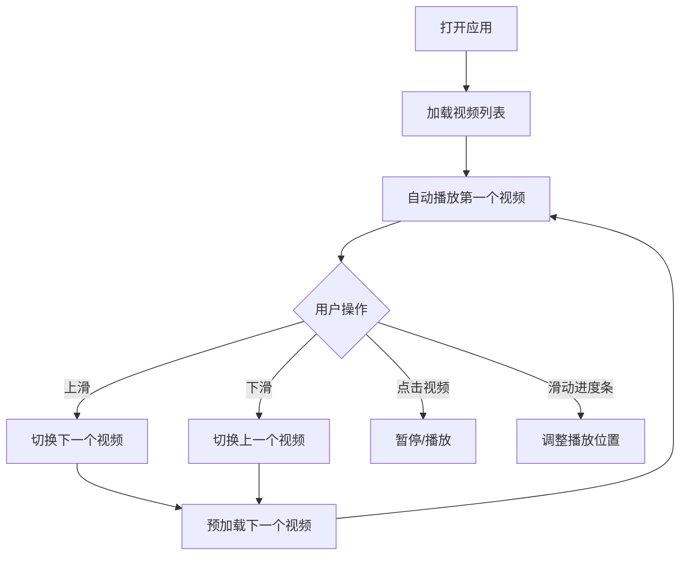
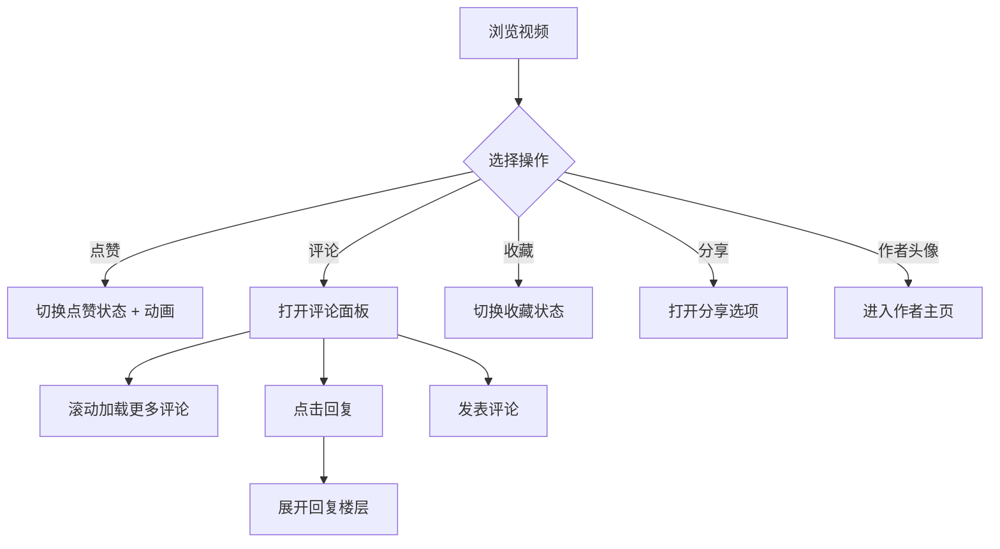
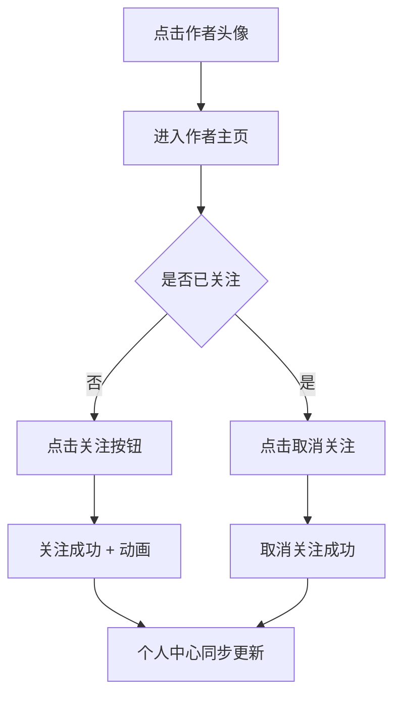

## 1. 产品概述
本项目是一个仿短视频平台的Web端H5应用，模仿抖音、快手网页版的交互体验，为用户提供沉浸式竖屏短视频浏览体验。
- 主要面向移动端用户，提供流畅的视频浏览、互动和社交功能
- 目标是打造接近原生App的交互体验，包括流畅的滑动切换、即时互动反馈等

## 2. 核心功能

### 2.1 用户角色
| 角色 | 注册方式 | 核心权限 |
|------|----------|----------|
| 普通用户 | 游客身份（无需注册） | 浏览视频、点赞、收藏、评论、分享、关注作者、查看个人中心 |

### 2.2 功能模块
1. **视频播放页**：沉浸式竖屏全屏播放、上下滑动切换视频、视频控制（静音、倍速、进度条）
2. **互动功能**：点赞/取消点赞、收藏、评论、分享
3. **评论系统**：评论列表无限滚动、评论点赞、回复楼层展示
4. **作者主页**：作者信息展示、关注/取消关注、作品列表
5. **个人中心**：用户信息、关注列表、粉丝列表、收藏作品

### 2.3 页面详情
| 页面名称 | 模块名称 | 功能描述 |
|----------|----------|----------|
| 视频播放页 | 视频播放器 | 沉浸式竖屏全屏播放、自动播放、循环播放 |
| 视频播放页 | 滑动切换 | 上下滑动切换视频、滑动过渡动画、卡顿优化 |
| 视频播放页 | 视频控制 | 静音/出声切换、进度条拖拽、倍速播放（0.5x/1x/1.5x/2x） |
| 视频播放页 | 互动按钮 | 点赞（带动画）、取消点赞、收藏、评论入口、分享 |
| 视频播放页 | 视频信息 | 作者头像、昵称、视频描述、音乐信息 |
| 评论弹窗 | 评论列表 | 无限滚动加载、下拉刷新、回复楼层展开/收起 |
| 评论弹窗 | 评论互动 | 评论点赞、回复评论、发布评论 |
| 作者主页 | 作者信息 | 头像、昵称、简介、关注数、粉丝数、获赞数 |
| 作者主页 | 关注功能 | 关注/取消关注按钮、状态切换动画 |
| 作者主页 | 作品列表 | 网格布局展示作者所有视频 |
| 个人中心 | 用户信息 | 头像、昵称、ID、简介编辑 |
| 个人中心 | 功能菜单 | 我的关注、我的粉丝、我的收藏、设置 |
| 个人中心 | 作品展示 | 我的作品、收藏作品Tab切换 |

## 3. 核心流程

### 3.1 视频浏览流程
用户打开应用 → 自动播放第一个视频 → 上滑切换下一个视频 → 下滑切换上一个视频 → 点击暂停/播放 → 滑动进度条调整播放位置

### 3.2 互动操作流程
用户浏览视频 → 点击点赞按钮（触发点赞动画）→ 点击评论按钮 → 弹出评论面板 → 查看评论/发表评论/回复评论 → 点击收藏按钮 → 点击分享按钮

### 3.3 关注流程
用户点击作者头像 → 进入作者主页 → 点击关注按钮 → 关注成功 → 可在个人中心查看关注列表

## 4. 用户界面设计

### 4.1 设计风格
- **主色调**：黑色（#000000）作为背景主色，红色（#FE2C55）作为品牌强调色，白色（#FFFFFF）作为文字主色
- **辅助色**：灰色系列用于次级文字和边框（#B2B2B2、#8A8A8A、#3F3F3F）
- **按钮风格**：圆形图标按钮，点击带有缩放和颜色变化动画
- **字体**：使用 PingFang SC 作为主要字体，标题加粗，正文适中
- **布局风格**：全屏沉浸式布局，右侧垂直排列互动按钮，底部展示视频信息
- **图标风格**：线性简洁图标，激活状态使用填充样式和红色

### 4.2 页面设计概述
| 页面名称 | 模块名称 | UI元素 |
|----------|----------|--------|
| 视频播放页 | 视频区域 | 全屏视频、中央播放/暂停按钮（点击显示）、顶部状态栏 |
| 视频播放页 | 右侧互动区 | 头像+关注、点赞（数字）、评论（数字）、收藏（数字）、分享、音乐碟片 |
| 视频播放页 | 底部信息区 | 作者昵称、视频描述、音乐信息（滚动） |
| 视频播放页 | 控制层 | 底部进度条、倍速选择、静音按钮 |
| 评论弹窗 | 顶部 | 评论数量、关闭按钮 |
| 评论弹窗 | 输入区 | 评论输入框、发送按钮 |
| 评论弹窗 | 评论列表 | 头像、昵称、时间、评论内容、点赞按钮、回复按钮、回复楼层 |
| 作者主页 | 顶部 | 返回按钮、分享按钮 |
| 作者主页 | 信息区 | 头像、昵称、ID、关注/粉丝/获赞、关注按钮、简介 |
| 作者主页 | Tab栏 | 作品、喜欢、收藏 |
| 作者主页 | 作品网格 | 3列视频缩略图网格 |
| 个人中心 | 顶部 | 设置按钮、编辑资料 |
| 个人中心 | 用户信息 | 头像、昵称、ID、简介、关注/粉丝/获赞 |
| 个人中心 | 功能入口 | 我的关注、我的粉丝、我的收藏 |
| 个人中心 | Tab栏 | 作品、收藏、喜欢 |

### 4.3 响应式设计
- **移动端优先**：主要针对手机竖屏设计，固定宽度375px-430px
- **触摸优化**：所有按钮最小触摸区域44x44px，支持触摸滑动、长按等手势
- **适配范围**：iPhone SE（375px）到 iPhone 15 Pro Max（430px）
- **横屏处理**：提示用户竖屏观看，或自适应调整布局

### 4.4 动效设计
- **点赞动画**：点击爱心图标时，图标放大1.2倍后回弹，颜色从白色变为红色，伴随向上飘散的爱心粒子效果
- **滑动切换**：视频切换使用平滑的translateY过渡，新视频从底部滑入，旧视频从顶部滑出
- **关注动画**：关注按钮点击后，文字从"关注"变为"已关注"，按钮背景从红色变为透明灰色边框
- **评论面板**：从底部向上滑入，带有遮罩层渐变效果
- **进度条**：拖拽时有放大效果，缓冲进度和播放进度分层显示
- **音乐碟片**：右侧音乐图标持续旋转，暂停播放时停止旋转
