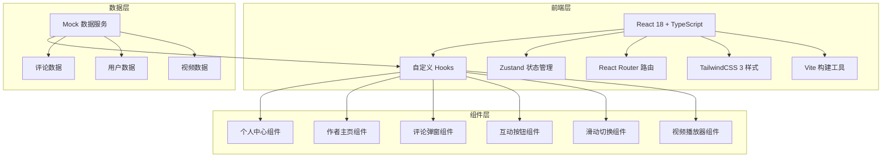
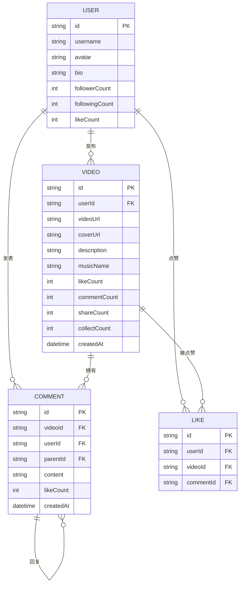

## 1. 架构设计



## 2. 技术描述

* **前端框架**：React\@18 + TypeScript\@5

* **构建工具**：Vite\@5

* **样式方案**：TailwindCSS\@3 + PostCSS

* **路由管理**：React Router DOM\@6

* **状态管理**：Zustand（轻量级状态管理）

* **初始化方式**：使用 vite 创建 React + TypeScript 项目

* **后端方案**：无后端，使用本地 Mock 数据

* **数据存储**：localStorage 存储用户互动数据（点赞、收藏、关注）

* **图标库**：Lucide React（简洁风格图标）

## 3. 目录结构

```
/
├── src/
│   ├── components/          # 公共组件
│   │   ├── VideoPlayer.tsx  # 视频播放器
│   │   ├── VideoFeed.tsx    # 视频流（上下滑动）
│   │   ├── ActionBar.tsx    # 右侧互动按钮
│   │   ├── CommentModal.tsx # 评论弹窗
│   │   ├── ProgressBar.tsx  # 进度条
│   │   ├── SpeedControl.tsx # 倍速控制
│   │   └── LikeAnimation.tsx# 点赞动画
│   ├── pages/               # 页面组件
│   │   ├── HomePage.tsx     # 首页（视频流）
│   │   ├── AuthorPage.tsx   # 作者主页
│   │   └── ProfilePage.tsx  # 个人中心
│   ├── store/               # 状态管理
│   │   ├── useVideoStore.ts # 视频相关状态
│   │   ├── useUserStore.ts  # 用户相关状态
│   │   └── useUIStore.ts    # UI 状态
│   ├── hooks/               # 自定义 Hooks
│   │   ├── useVideo.ts      # 视频控制 Hook
│   │   ├── useSwipe.ts      # 滑动手势 Hook
│   │   └── useInfiniteScroll.ts # 无限滚动
│   ├── data/                # Mock 数据
│   │   ├── videos.ts        # 视频数据
│   │   ├── users.ts         # 用户数据
│   │   └── comments.ts      # 评论数据
│   ├── types/               # TypeScript 类型定义
│   │   └── index.ts
│   ├── utils/               # 工具函数
│   │   ├── format.ts        # 格式化函数
│   │   └── storage.ts       # 本地存储
│   ├── App.tsx
│   ├── main.tsx
│   └── index.css
├── public/                  # 静态资源
│   └── videos/              # 示例视频
├── package.json
├── vite.config.ts
├── tsconfig.json
└── tailwind.config.js
```

## 4. 路由定义

| 路由            | 页面          | 说明            |
| ------------- | ----------- | ------------- |
| `/`           | HomePage    | 首页 - 沉浸式视频流播放 |
| `/author/:id` | AuthorPage  | 作者主页          |
| `/profile`    | ProfilePage | 个人中心          |

## 5. 核心技术实现

### 5.1 视频流滑动切换

* 使用 CSS `transform: translateY()` 实现平滑过渡

* 预加载前后各1个视频，实现无感切换

* 使用 `touchstart`、`touchmove`、`touchend` 事件处理滑动手势

* 滑动距离超过阈值（50px）才触发切换，避免误操作

* 使用 `will-change: transform` 优化性能

### 5.2 视频播放器优化

* 使用原生 `<video>` 标签，配合 `playsInline` 属性支持 iOS 内联播放

* 实现 `requestVideoFrameCallback` 精确的进度更新

* 使用 `preload="metadata"` 平衡加载速度和流量

* 监听 `waiting` 事件显示加载状态

### 5.3 无限滚动评论

* 使用 Intersection Observer API 实现滚动监听

* 分页加载，每次加载10条评论

* 虚拟滚动（可选）优化大量评论性能

* 节流滚动事件，避免频繁触发

### 5.4 状态管理

* 视频播放状态：当前视频索引、播放状态、音量、倍速

* 用户互动状态：点赞列表、收藏列表、关注列表

* UI 状态：评论面板显示、倍速面板显示、加载状态

### 5.5 性能优化

* 视频预加载和预渲染

* 离屏视频暂停播放，释放资源

* 使用 `transform` 和 `opacity` 做动画，避免重排重绘

* 防抖和节流处理频繁触发的事件

* CSS 硬件加速：`translateZ(0)`、`will-change`

### 5.6 触摸交互优化

* 最小触摸区域 44x44px

* 区分点击和滑动手势

* 防止触摸穿透

* 滑动时禁用页面滚动

## 6. 数据模型

### 6.1 数据模型定义



### 6.2 类型定义

```typescript
// 用户类型
interface User {
  id: string;
  username: string;
  avatar: string;
  bio: string;
  followerCount: number;
  followingCount: number;
  likeCount: number;
}

// 视频类型
interface Video {
  id: string;
  userId: string;
  videoUrl: string;
  coverUrl: string;
  description: string;
  musicName: string;
  likeCount: number;
  commentCount: number;
  shareCount: number;
  collectCount: number;
  createdAt: string;
  author: User;
}

// 评论类型
interface Comment {
  id: string;
  videoId: string;
  userId: string;
  parentId: string | null;
  content: string;
  likeCount: number;
  createdAt: string;
  user: User;
  replies?: Comment[];
}

// 用户互动状态
interface UserInteraction {
  likedVideos: string[];
  collectedVideos: string[];
  followingUsers: string[];
  likedComments: string[];
}
```

### 6.3 Mock 数据

* 准备20条视频数据，使用公开可访问的示例视频URL

* 准备50条评论数据，包含多级回复

* 准备10个用户数据，包括当前登录用户

* 数据格式符合 TypeScript 类型定义

## 7. 动画实现方案

### 7.1 点赞动画

* 使用 CSS `@keyframes` 实现心跳和缩放

* 粒子效果使用多个 `span` 元素，随机位置和延迟

* 动画结束后自动移除 DOM 元素

### 7.2 滑动切换动画

* 使用 CSS `transition: transform 0.3s ease-out`

* 滑动时实时更新 `transform` 值

* 松开后根据速度和距离决定是否切换

### 7.3 评论面板动画

* 使用 `transform: translateY(100%)` 到 `translateY(0)`

* 遮罩层使用 `opacity` 过渡

* 总时长 0.3s，缓动函数 `ease-out`

### 7.4 关注按钮动画

* 使用 CSS `transform: scale()` 实现点击反馈

* 状态切换时使用 `opacity` 过渡文字变化

